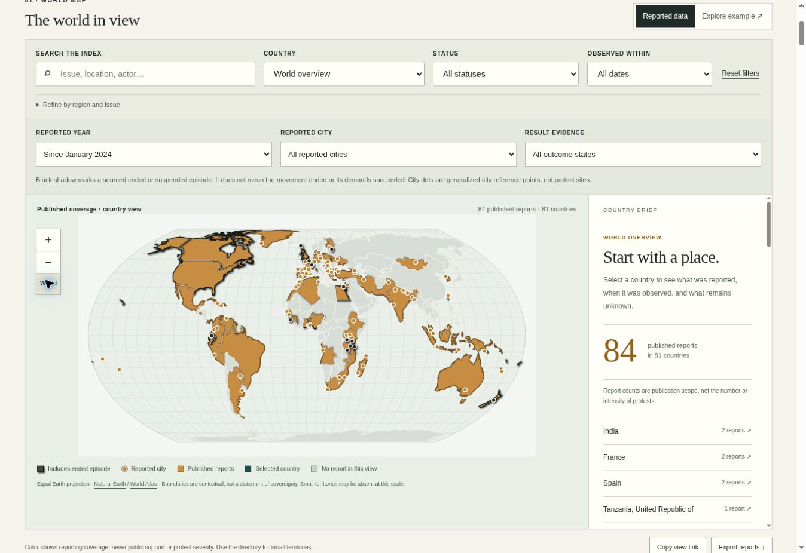

# Release evidence — 2 October 2026

## Release 3 — historical research from 2024

Verified on 2 October 2026. Runtime commit: `64785a20f7fb30de8c076139d27726aa88a07c38`. [Live atlas](https://occult-kranti.github.io/protest-atlas/#atlas). [Successful Pages workflow](https://github.com/occult-kranti/protest-atlas/actions/runs/37067775278). The earlier historical-data deployment and city-reset patch also succeeded (runs `37067453098` and `37067550820`).

| Check | Evidence |
| --- | --- |
| Research scope | 84 episodes, 81 countries/territories, 118 city references, 128 source records. Initial queries logged for all 249 entries; 168 have no published episode. No exhaustive history or current-activity claim. |
| Semantic review | Separate skeptical advisor read the principal ending source for all 18 ended/suspended episodes plus four targeted followups. Applied 13 reversed stance corrections and Tanzania's missing status-source reference to regional inputs; regenerated public files and checked all 14 resolutions. |
| Automated verification | 41 Python tests passed. All eight named JavaScript tests passed using `node tests/test_explorer.mjs` and `node --test --test-isolation=none --test-reporter=spec tests/test_explorer.mjs`. Build and syntax checks passed. The isolated runner in this workspace only reported a file-level test, so the non-isolated/direct runs supplied named-test evidence. GitHub workflow test and deployment gates passed. |
| World/city map | 101 rendered city markers; 17 unresolved city names remain in text/selectors. World panel and index both show 84 records. Ended filter returns 18; 17 corresponding country polygons are available because Faroe Islands has no separate polygon at this scale. |
| Endings/results | New Zealand record showed bounded final-day ending, later bill rejection, named beneficiary/setback assessments labeled inference, source links and an explicit no-established-protest-causation note. Ended/suspended styling does not imply countrywide cessation. |
| Filters and URL | Combined 2024 + Paris + documented-change filters returned the farmers' record. Reload preserved all three selected values and the one-record result. Reported-year 2024 alone returned 36 records because matching includes dated timeline entries, rather than only the latest-observation year. |
| Small-country/keyboard route | Andorra selector opened its record despite absent polygon. Pressing Enter on its city point selected `AD:Andorra la Vella` and the same one-record index. |
| Missing coverage | Iceland panel explicitly distinguished initial search logged, source coverage not reviewed, no published episode and five unreviewed discovery leads. No zero-protest inference. |
| Reset correction | France provided six city names plus the all-cities option. Reset restored 118 city names plus the all-cities option (119 options), 84 records and world scope. Versioned module/CSS references resolve observed browser caching of the prior controls. |
| Responsive layout | Real iframe outer widths 320, 390, 768 and 1440 px yielded content widths 305, 375, 753 and 1425 px, respectively. At each, document scroll width equaled client width and 101 city markers were present. Phone historical filters/map were visually inspected; zoom changed from 1.00 to 1.60. |
| Publication boundary | All historical JSON passes strict provenance validators. Coarse city source dataset and raw research remain outside the static allowlist. Credential-pattern scan found no matches in project text artifacts. |

Remaining limits: this is a selective AI-assisted research index, predominantly English-source, without independent human editorial sign-off. No country is certified complete. Physical touch/pinch, screen-reader, 200% zoom and final browser download-byte capture remain unverified; the automated CSV serializer checks passed. See HISTORICAL_RESEARCH.md, ROADMAP.md and the advisor's retained review for scope and next work. Previous release evidence below records its historical state, not the current dataset.

## Release 2 — world map and review workspace

- Map implementation commit: `f915dcaf4131ca7c131c1cf7159d26ff15b8c212`.
- [Pages build and deployment succeeded](https://github.com/occult-kranti/protest-atlas/actions/runs/37059809706).
- [Live world map](https://occult-kranti.github.io/protest-atlas/#atlas) and [review desk](https://occult-kranti.github.io/protest-atlas/review.html) opened and inspected.
- Final follow-up preserves this layout, improves singular wording/download feedback, and records this evidence.

| Check | Observed result |
| --- | --- |
| Automated trust boundaries | 28 Python tests and 6 JavaScript test cases passed; includes coverage-date/source consistency, unverified-candidate isolation, manual readiness gates, duplicate handling, time-window filtering, URL round trip, CSV escaping and exact map record totals. |
| Static build | Required local map/review assets included; only explicit allowlisted files enter `_site`; candidate and review drafts excluded. Source observation dates unchanged. |
| Map and linked evidence | Live map rendered all 177 geography areas; India selection updated country brief/list; Enter on France selected its record; country zoom, zoom in/out and world reset worked. Monaco displayed missing-polygon explanation and disabled country zoom. |
| Shared view | Spain + 7-day observation window copied into URL and restored after reload. |
| Example isolation | One illustrative record and one illustrative map country; separate labels/color; CSV and sharing disabled for example mode; switching back restored 3 reported records. |
| Responsive layout | Real iframe outer widths 320, 390, 768, 1440 px produced inner content widths 305, 375, 753, 1425 px because of scrollbars. Document scroll width equaled client width at all four. Mobile typography and stacked layout visually inspected. Review desk empty state also passed 320 px outer-width overflow check. |
| Review UI | Imported a non-sensitive QA candidate containing an already-published public source URL. Existing URL flagged; blank ready-for-editor attempt rejected for missing manual evidence and duplicate source; duplicate disposition accepted only with published event ID. Export action requested a local packet, without publication. |
| Download limitation | Browser UI callbacks fired for CSV and packet export. The cloud download event wait timed out/reset the tool, and completed file bytes were not captured. Serialized CSV/packet validation is automated; final browser save-to-disk behavior remains a manual release check. User messages now say download requested, not saved. |
| Runtime diagnostics | Inspected error sample contained browser-extension diagnostic errors, not site-origin errors. This is a sampled check, not a comprehensive console audit. |
| Design/source audit | Report outlines strengthened, light/dark keyboard focus halo added, legend scoped to current filters, and shortlist/clear-selection keyboard focus preserved. See MAP_DESIGN_SOURCES.md. |

Remaining: physical touch/pinch, screen-reader and 200% browser zoom checks; review-form mobile editing and download-file capture. The reviewed layout is not a claim of full accessibility certification. The country ledger still has only three English-source checks and 246 not-reviewed countries/territories. Independent human editorial review, local-language coverage, broader real-world reporting, and the correction drill remain operational gates. No data freshness dates changed for this interface release.

## Initial release — published result

- Repository created: https://github.com/occult-kranti/protest-atlas
- Live website opened and inspected: https://occult-kranti.github.io/protest-atlas/
- Initial implementation commit: `cd2e50134fd16906d4f9cafbb7e948c5b953eb05`
- Initial Pages workflow passed: https://github.com/occult-kranti/protest-atlas/actions/runs/37053913494
- First GitHub-hosted discovery workflow passed: https://github.com/occult-kranti/protest-atlas/actions/runs/37054141060

The initial local GDELT request returned HTTP 429. The subsequent GitHub-hosted run succeeded. This confirms one successful run, not guaranteed upstream availability or schedule reliability. Discovery writes unverified metadata to a workflow artifact; it never updates the public event ledger.

## Initial release — checks performed

| Check | Evidence / result |
| --- | --- |
| Python data/publication tests | 15 tests passed; covers future and contradictory times, source references, unsafe URLs, private/exact-location fields, duplicate keys, candidate isolation, symlinks and unchanged editorial dates |
| Actual snapshot build | 3 source-checked seed reports, 249 country/territory entries and a separate example pass validation; only allowlisted files published |
| UI source and simulation | Module syntax, 11 temporal/UTC assertions, contrasts, label/ID checks, simulated loading/filters/empty/error/example/escaping checks; see UX_SPEC.md |
| Live desktop | Source-index page loaded; screenshot visually inspected; filtering, source detail, Escape/focus restoration, synthetic-mode separation and absent-country explanation verified |
| Source uncertainty | All three records single-source and present status unknown; no human editorial review claimed; date-only evidence explicit |
| Licensing | Country directory CC BY-SA attribution and license retained; news linked, no images/full articles redistributed; ACLED excluded |
| Credential scan | No GitHub token/private-key pattern in project files; authentication material kept outside repository and public build |

## Resolved skeptical findings

Freshness now uses `last_observed_at`; opening an old source cannot renew the activity date. Unknown onset remains null. Support/opposition references a named target. Intensity sources appear in the detail panel, while disruption, violence and state response stay separate. A march alone is not labeled disruption; assembly restrictions remain state action. Blanket verified labels were replaced with AI-assisted source-check labels. Exactly 72 hours expires ongoing status.

## Initial release — limits recorded at that time

This is a sparse reporting pilot, not comprehensive live coverage. Broad country-language review, independent human editing, a review-queue application and a geographic map remain roadmap work. Mobile viewport, 200% zoom and assistive-technology checks are not claimed; local browser installation failed, though deployed desktop verification succeeded. Browser-extension diagnostic errors were observed; no site-origin console failure appeared in the inspected log sample.

Initial source checking and web deployment do not verify real-world truth or complete protest coverage. The roadmap names the human-reviewed pilot as the next operational gate.
